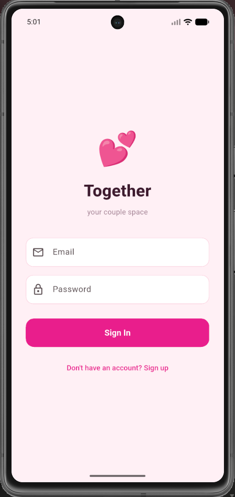
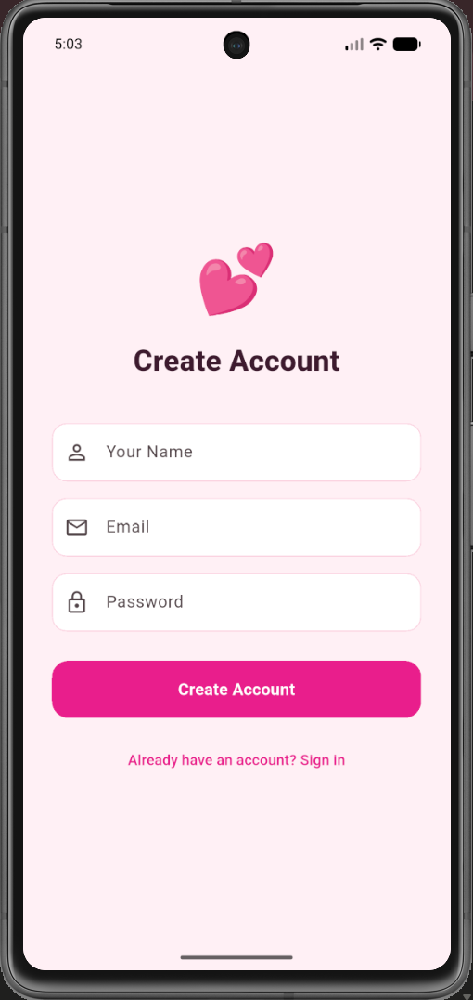
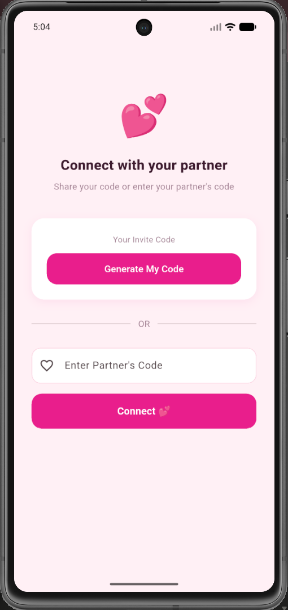
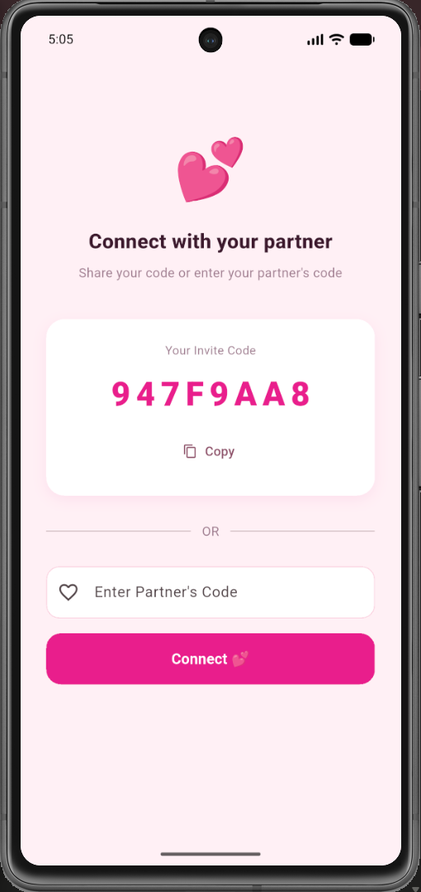
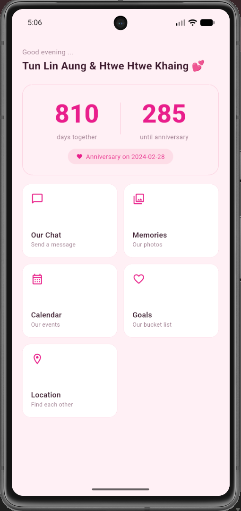
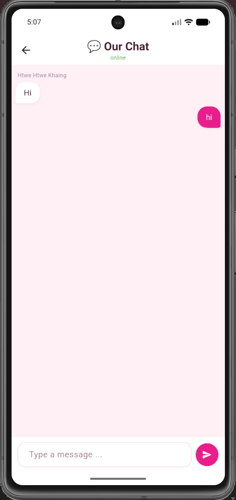
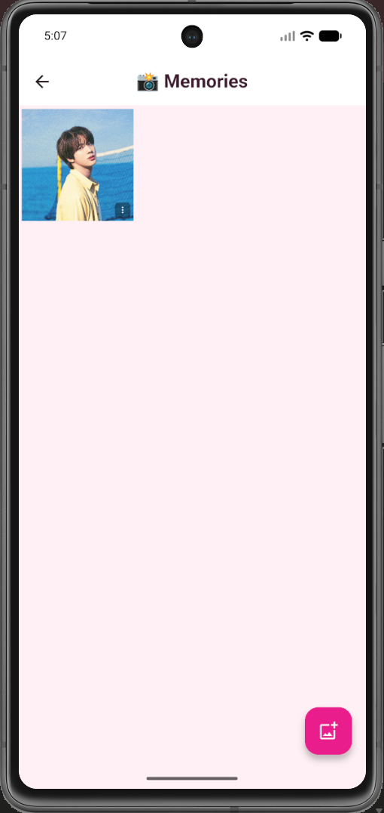
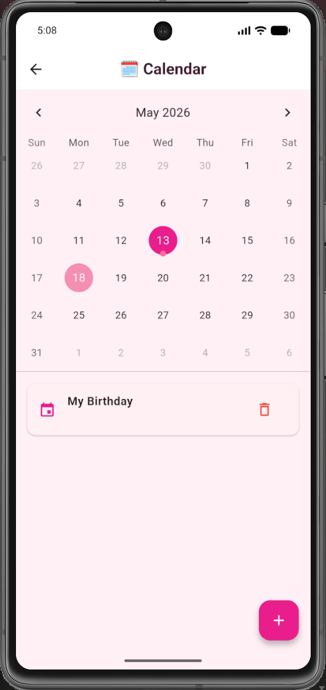
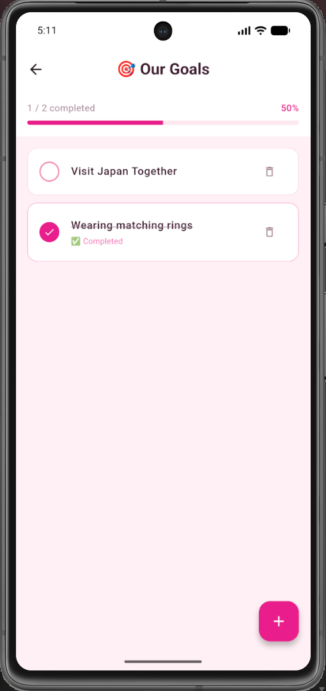
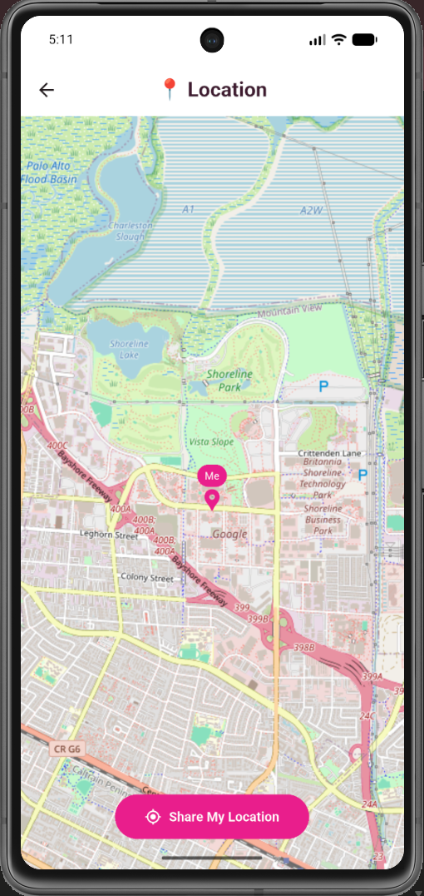

<p align="center">
  
</p>

<h1 align="center">Since Together 💕</h1>

<p align="center">
  <strong>A private couples app — your shared space, just for two.</strong>
</p>

<p align="center">
  
  
  
  
</p>

---

## ✨ About

**Since Together** is a Flutter app built for couples — a private, intimate space where two people can count their days together, chat in real-time, share memories, plan events, set shared goals, and even see each other's location on a live map.

Everything is synced in real-time via **Supabase**, so both partners always stay connected.

---

## 📸 Screenshots

<table>
  <tr>
    <td align="center"><br/><sub>Login</sub></td>
    <td align="center"><br/><sub>Register</sub></td>
    <td align="center"><br/><sub>Invite or Connect</sub></td>
    <td align="center"><br/><sub>Connect with Code</sub></td>
  </tr>
  <tr>
    <td align="center"><br/><sub>Home</sub></td>
    <td align="center"><br/><sub>Chat</sub></td>
    <td align="center"><br/><sub>Memories</sub></td>
    <td align="center"><br/><sub>Calendar</sub></td>
  </tr>
  <tr>
    <td align="center"><br/><sub>Goals</sub></td>
    <td align="center"><br/><sub>Location</sub></td>
    <td></td>
    <td></td>
  </tr>
</table>

---

## 🚀 Features

| Feature | Description |
|---|---|
| 💑 **Couple Pairing** | Create an account and invite your partner with a unique code |
| ⏳ **Days Together** | Countdown of days since your relationship started & days until anniversary |
| 💬 **Real-time Chat** | Private messaging with live online status via Supabase Realtime |
| 🖼️ **Memories** | Upload and browse shared photos stored in Supabase Storage |
| 📅 **Calendar** | Add and manage shared events and important dates |
| 🎯 **Goals** | Create a shared bucket list with progress tracking |
| 📍 **Location Sharing** | See each other on a live map powered by OpenStreetMap |

---

## 🛠️ Tech Stack

| Layer | Technology |
|---|---|
| **Framework** | Flutter (Dart) |
| **Backend / Auth** | Supabase (PostgreSQL + Auth + Storage + Realtime) |
| **State Management** | Flutter Riverpod |
| **Navigation** | GoRouter |
| **Map** | flutter_map + OpenStreetMap tiles |
| **Location** | geolocator |
| **Image Caching** | cached_network_image |
| **Image Picking** | image_picker |
| **Calendar UI** | table_calendar |
| **Fonts** | Google Fonts (Nunito) |
| **Splash Screen** | flutter_native_splash |
| **App Icon** | flutter_launcher_icons |

---

## 🗄️ Database Schema

The full schema lives in [`supabase/migrations/001_initial.sql`](supabase/migrations/001_initial.sql).

```
auth.users          ← Supabase built-in auth
    │
    ▼
profiles            ← Display name, avatar
    │
    ▼
couples             ← Links two users, stores invite_code + anniversary_date
    │
    ├── messages    ← Real-time chat
    ├── photos      ← Supabase Storage references
    ├── events      ← Shared calendar events
    ├── goals       ← Shared bucket list
    └── locations   ← Live location (one row per user per couple)
```

**Row Level Security (RLS)** is enabled on every table — users can only access data belonging to their own couple.

**Realtime** is enabled on: `messages`, `events`, `goals`, `locations`.

---

## 🔧 Getting Started

### Prerequisites

- Flutter SDK `^3.11.5`
- A [Supabase](https://supabase.com) project

### 1. Clone the repo

```bash
git clone https://github.com/TunLinAung123/since-together-app.git
cd since-together-app
```

### 2. Set up Supabase

1. Create a new Supabase project at [supabase.com](https://supabase.com)
2. Run the migration file in the Supabase SQL Editor:
   ```
   supabase/migrations/001_initial.sql
   ```
3. Create a **Storage bucket** named `photos` (set to public)
4. Copy your **Project URL** and **Anon Key**

### 3. Configure credentials

Update `lib/core/constants/supabase_constants.dart`:

```dart
class SupabaseConstants {
  static const url = 'YOUR_SUPABASE_PROJECT_URL';
  static const anonKey = 'YOUR_SUPABASE_ANON_KEY';
}
```

### 4. Install dependencies & run

```bash
flutter pub get
flutter run
```

---

## 📱 Platform Setup

### Android — Location Permission

The following permissions are declared in `android/app/src/main/AndroidManifest.xml`:

```xml
<uses-permission android:name="android.permission.ACCESS_FINE_LOCATION" />
<uses-permission android:name="android.permission.ACCESS_COARSE_LOCATION" />
```

### iOS — Location Permission

Location usage descriptions are set in `ios/Runner/Info.plist`:

```xml
<key>NSLocationWhenInUseUsageDescription</key>
<string>Since Together uses your location to share it with your partner.</string>
<key>NSLocationAlwaysAndWhenInUseUsageDescription</key>
<string>Since Together uses your location to share it with your partner.</string>
```

---

## 📁 Project Structure

```
lib/
├── core/
│   └── constants/        # Supabase credentials, app colors
├── features/
│   ├── auth/             # Login, register, couple pairing
│   ├── home/             # Home dashboard with countdown
│   ├── chat/             # Real-time messaging
│   ├── memories/         # Photo gallery
│   ├── calendar/         # Shared events
│   ├── goals/            # Shared bucket list
│   └── location/         # Live map & location sharing
└── shared/
    └── theme/            # App-wide theme & colors
```

---

## 🤝 How Couple Pairing Works

1. **User A** signs up → a `couple` row is created with a unique `invite_code`
2. **User B** signs up → enters User A's invite code
3. The `couple.user2_id` is updated → both users are now linked
4. All features (chat, photos, events, goals, location) are scoped to this couple

---

## 📄 License

This project is private and not licensed for public distribution.

---

<p align="center">Made with 💕 for couples</p>
